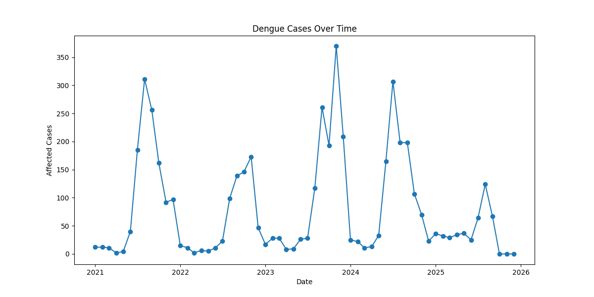
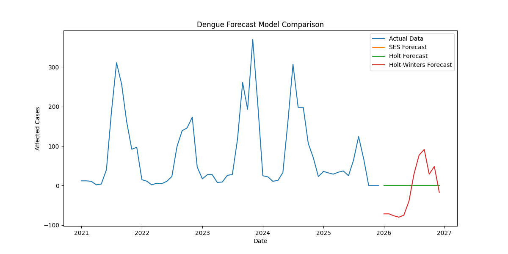

# Dengue Case Forecasting using Time Series

This project analyzes dengue case trends from **2021–2025** and predicts future dengue cases using **time series forecasting** techniques.

---

## Technologies Used

- Python
- Pandas
- NumPy
- Matplotlib
- Seaborn
- Statsmodels
- Time Series Forecasting

---

## Project Structure

```
Dengue-Case-Prediction
│
├── data
│   └── dengue.csv
│
├── models
│   └── dengue_forecast_model.pkl
│
├── notebook
│   └── dengue_analysis.ipynb
│
├── src
│
├── trend_graph.png
├── forecast_comparison.png
│
├── app.py
├── requirements.txt
├── README.md
└── .gitignore
```

---

## Dengue Case Trend



---

## Model Forecast Comparison



---

## Model Used

This project uses the **Holt-Winters Exponential Smoothing** model for forecasting dengue cases.

The model captures:

- Trend in dengue cases
- Seasonal patterns
- Future monthly case predictions

---

## How to Run the Project

1. Clone the repository
